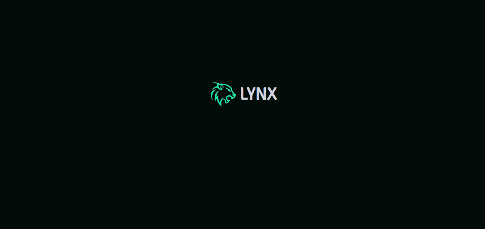

  

## Web de Criptomonedas con TypeScript y React

¡Este proyecto es una aplicación web dedicada al seguimiento de criptomonedas, con una vista detallada de los precios actuales del mercado.
Desarrollada con TypeScript, React, Tailwind CSS, y shadcn/ui, con un diseño simple pero vistoso, con una experiencia de usuario intuitiva y atractiva. Además, cada moneda cuenta con una gráfica en tiempo real que permite visualizar su evolución en el mercado.

### Tecnologías Utilizadas

-   **TypeScript.**
-   **React.**
-   **Tailwind CSS**
-   **shadcn/ui**: Componentes de interfaz de usuario.
-   **Zustand**: Estado global.
-   **Axios**: Solicitudes a la API de CoinGecko.
-   **Wouter**: Opción liviana para manejar la navegación entre las secciones de la aplicación.
-   **Recharts**: Usado para construir los graficos.
-   **CoinGecko API**: Fuente externa utilizada para obtener datos actualizados sobre las criptomonedas.

#### Aplicación desplegada en Vercel

## PROYECTO EN PROCESO

